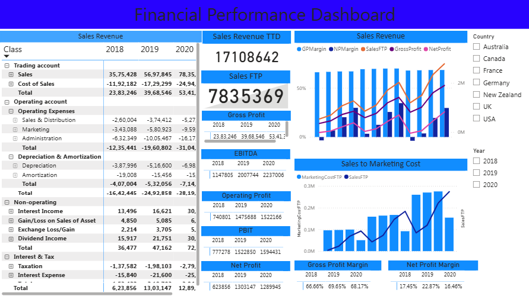

# 📊 Financial Reporting & KPI Analysis Dashboard

An interactive Power BI dashboard built to analyse financial performance across revenue, profitability, operating expenses, and sales — with country and year-level filtering for dynamic reporting.

---

## 🔍 Project Overview

Financial teams need a clear, consolidated view of business performance across multiple metrics and geographies. This dashboard transforms raw financial data into an interactive reporting tool that tracks key KPIs from 2018 to 2020 across 6 countries.

---

## 🛠️ Tools Used

| Tool | Purpose |
|---|---|
| Power BI | Dashboard development and visualisation |
| Excel | Data source and preprocessing |
| DAX | KPI measures and calculated columns |

---

## 📸 Dashboard Preview

## 📌 Dashboard Features

### KPI Cards
- **Sales Revenue TTD** — 17,108,642
- **Sales FTP** — 7,835,369
- **Gross Profit** — Year-on-year: 23.8M → 39.7M → 53.4M
- **EBITDA** — 1,147,805 → 2,007,744 → 2,237,006
- **Operating Profit** — 740,801 → 1,475,688 → 1,522,166
- **PBIT** — 777,278 → 1,522,850 → 1,594,431
- **Net Profit** — 623,856 → 1,303,147 → 1,289,945

### Profitability Analysis
- **Gross Profit Margin** — 66.66% (2018) → 69.65% (2019) → 68.17% (2020)
- **Net Profit Margin** — 17.45% (2018) → 22.87% (2019) → 16.46% (2020)

### Sales & Cost Analysis
- Sales Revenue trend by year with GP Margin, NP Margin, Gross Profit, and Net Profit overlays
- Sales to Marketing Cost comparison across years

### P&L Breakdown
- Full income statement view: Trading Account, Operating Expenses, Depreciation & Amortisation, Non-Operating items, Interest & Tax
- Year-on-year comparison: 2018, 2019, 2020

### Filters
- **Country:** Australia, Canada, France, Germany, New Zealand, UK, USA
- **Year:** 2018, 2019, 2020

---

## 💡 Key Insights

- Sales revenue grew consistently from 2018 to 2020, with gross profit nearly doubling over the period
- Gross profit margin remained stable around 67–70%, indicating controlled cost of sales
- Net profit margin dipped in 2020 (16.46%) despite revenue growth, suggesting increased operating or non-operating costs
- Marketing costs scaled with sales growth, maintaining a consistent sales-to-marketing ratio
- EBITDA grew year-on-year, reflecting improving operational efficiency

---

## 📁 Repository Structure

```
├── Finanicial_Reporting_And_Analysis(PowerBI).pbix   # Power BI dashboard file
├── Finacial_Data.xlsx                                 # Source data
├── financial-dashboard.png                            # Dashboard screenshot
└── README.md
```

---

## 🚀 How to Use

1. Download `Finanicial_Reporting_And_Analysis(PowerBI).pbix`
2. Open in Power BI Desktop
3. Use the Country and Year slicers to filter the dashboard dynamically

---

## 🔗 Connect

[](https://linkedin.com/in/satyam-singroul)
[](https://github.com/SatyamSinghSingroul)
